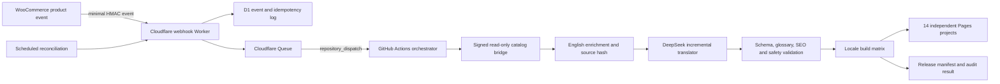

# OUOOO multilingual generator and automatic publishing plan

## Outcome

OUOOO will keep English at `https://ouooo.com` and publish 13 independent static language sites. A new, updated, unpublished, or deleted WooCommerce product will produce one idempotent catalog event. Only the affected product will be enriched, translated, validated, and merged; every enabled language site will then be rebuilt and deployed from the same catalog release.

The first multilingual release must not run until the English product schema, inquiry UX, content rules, and category model are stable. English remains the source of truth for every translation.

## Hosts and Cloudflare Pages projects

| Locale | Language | Host | Direction | Pages project |
| --- | --- | --- | --- | --- |
| `en` | English | `ouooo.com` | LTR | `ouooo` |
| `it` | Italiano | `it.ouooo.com` | LTR | `ouooo-it` |
| `es` | Español | `es.ouooo.com` | LTR | `ouooo-es` |
| `fr` | Français | `fr.ouooo.com` | LTR | `ouooo-fr` |
| `pt` | Português | `pt.ouooo.com` | LTR | `ouooo-pt` |
| `pl` | Polski | `pl.ouooo.com` | LTR | `ouooo-pl` |
| `de` | Deutsch | `de.ouooo.com` | LTR | `ouooo-de` |
| `fil` | Filipino | `fil.ouooo.com` | LTR | `ouooo-fil` |
| `hr` | Hrvatski | `hr.ouooo.com` | LTR | `ouooo-hr` |
| `sl` | Slovenščina | `sl.ouooo.com` | LTR | `ouooo-sl` |
| `ro` | Română | `ro.ouooo.com` | LTR | `ouooo-ro` |
| `ar` | العربية | `ar.ouooo.com` | RTL | `ouooo-ar` |
| `zh-hant` | 繁體中文 | `zh-hant.ouooo.com` | LTR | `ouooo-zh-hant` |
| `zh-hans` | 简体中文 | `zh-hans.ouooo.com` | LTR | `ouooo-zh-hans` |

Every subdomain must first be associated with its Pages project as a custom domain. DNS alone is not sufficient. Deployment uses prebuilt assets and Wrangler so every locale can have an independent build, rollback, deployment history, and sitemap.

## Event and publishing architecture



### Immediate event

The WordPress catalog bridge will hook published product changes, status transitions, and deletions. It sends only:

```json
{
  "eventId": "stable-unique-id",
  "sourceId": "public-product-source-id",
  "wpId": 123,
  "event": "publish|update|unpublish|delete",
  "modifiedAt": "ISO-8601"
}
```

It must never send customers, orders, prices, bridge secrets, WordPress users, private notes, or full product content. The Worker verifies timestamp, nonce, HMAC signature, content type, and body size before accepting an event.

WooCommerce Action Scheduler should debounce repeated saves and retry transient webhook failures. WordPress does not store a GitHub token. The GitHub credential is stored only as a Cloudflare Worker secret and is scoped to the OUOOO repository.

### Queue, deduplication, and fallback

- D1 stores unique event IDs, source IDs, state, attempts, last error, and release version.
- A Queue buffers bursts, retries transient consumer failures, and sends exhausted messages to a dead-letter queue.
- Events for the same source ID are coalesced; the newest status and modified time win.
- A scheduled reconciliation checks the bridge with an overlap window so missed webhooks are recovered.
- A daily full ID reconciliation detects products that are no longer public even if a deletion webhook was lost.

## Incremental catalog rules

1. `productId` and `sourceId` never change and are never translated.
2. Existing product and category slugs remain stable across languages. Visible titles and category names are translated, but shared paths keep `hreflang` mapping deterministic.
3. The English product is regenerated only when its normalized public source facts change.
4. A new English `sourceHash` marks every older translation as `stale`.
5. Only missing or stale translations call DeepSeek.
6. Images, SKUs, IDs, URLs, Catholic relevance flags, and verified specifications are preserved.
7. `MECRT` and other source branding are forbidden in public copy for every locale; remote image URLs are not rewritten.
8. Unpublish and delete events remove the product from every locale catalog and sitemap in the same release.

## Translation generator contract

The generator translates structured English content rather than raw WooCommerce/Alibaba text. The model receives no customer data, order data, private notes, secrets, or price tiers.

Translated fields:

- title, eyebrow, summary, description, Catholic context;
- category display names;
- image alternative text and variant labels;
- features, specification names and textual values;
- applications, FAQ, and structured-data text;
- shared interface messages and policy/content pages through separate locale dictionaries.

Never translated:

- `productId`, `sourceId`, SKU, hashes, image URLs, contact addresses;
- shared product/category slugs during the first multilingual version;
- schema.org keys and machine-readable enum values.

Each generated record stores `locale`, `sourceHash`, `contentHash`, `status`, `attempts`, `model`, `updatedAt`, and a sanitized error. Writes are atomic.

## Translation validation and fallback

Validation happens before a catalog can build:

- exact JSON schema and required fields;
- title and description length ranges adapted per language;
- no unsupported material, MOQ, certification, blessing, approval, or spiritual claims;
- Catholic terminology glossary for each locale;
- identifiers, SKUs, URLs, arrays, and verified facts preserved;
- no HTML/script injection or source branding;
- correct locale, canonical host, `lang`, Open Graph locale, and RTL direction;
- no accidental English duplication above a defined threshold.

Retry transient DeepSeek or validation failures with backoff. If an existing valid translation is available, keep it live while the new translation retries. For a brand-new product with no translation, publish the English fallback only when the release policy explicitly allows it; mark that localized page `noindex` until a valid translation is ready. The normal goal is to finish all translations before the coordinated release.

## Coordinated release

The orchestrator produces one immutable release manifest:

```json
{
  "releaseId": "timestamp-and-commit",
  "changedProductIds": ["..."],
  "sourceCatalogHash": "sha256...",
  "locales": {
    "en": { "catalogHash": "sha256...", "status": "ready" },
    "es": { "catalogHash": "sha256...", "status": "ready" }
  }
}
```

All locale catalogs must validate and all static builds must succeed before production deployment begins. Locale projects deploy in parallel, with English deployed last. A failed deployment is retried without rebuilding unchanged translations. The previous successful Pages deployment remains the rollback target.

Because separate Pages projects cannot switch atomically at the exact same millisecond, the system guarantees a coordinated, idempotent, eventually consistent release with a shared `releaseId`, not a distributed atomic transaction.

## SEO and GEO requirements

- English is canonical at `ouooo.com` and supplies `x-default`.
- Every published locale emits self-canonical URLs and reciprocal `hreflang` links only to successfully published locales.
- Each host has an independent sitemap and robots file.
- Product structured data uses localized names, descriptions, categories, properties, and FAQ while keeping identifiers stable.
- Language switcher links to the equivalent path on another host.
- Fallback-English localized pages are `noindex` and excluded from localized sitemaps until ready.
- Deleted/unpublished products return 404 or a deliberate replacement redirect and disappear from all sitemaps.

## Rollout plan

### Phase 1 — incremental English source

- Extend the catalog bridge with minimal product events and category data in list summaries.
- Add a persistent sync cursor, overlap window, ID reconciliation, merge/update/delete logic, and catalog release manifest.
- Prove that a new MECRT product updates English without scanning or rewriting all products.
- Add scheduled reconciliation before introducing translations.

### Phase 2 — translation generator and pilot

- Implement locale dictionaries, terminology glossaries, structured translation, retry, validation, and content hashes.
- Translate a representative pilot set into Spanish, including products, categories, navigation, contact, help, terms, privacy, returns, about, customization, and guides.
- Validate desktop/mobile layout, localized metadata, `hreflang`, sitemap, forms/contact links, and fallback behavior.

### Phase 3 — first language wave

- Create and attach Pages projects for `es`, `it`, `fr`, `de`, and `pt`.
- Generate the complete stored catalog only after pilot approval.
- Deploy and verify reciprocal `hreflang` across English and the first wave.

### Phase 4 — second language wave

- Add `pl`, `ro`, `hr`, `sl`, and `fil` using the proven pipeline.

### Phase 5 — RTL and CJK wave

- Add Arabic with full RTL visual QA.
- Add Traditional and Simplified Chinese with CJK typography, line breaking, and terminology review.

### Phase 6 — full automation

- Enable immediate webhook events, Queue/DLQ handling, reconciliation schedules, deployment notifications, and release dashboards.
- Run a controlled publish/update/unpublish/delete test and confirm all 14 hosts converge on one release.

## Required secrets and access

Cloudflare:

- Pages/Workers deployment API token with least privilege;
- account ID;
- webhook HMAC secret;
- bridge read secret;
- repository-dispatch token scoped only to the OUOOO repository.

GitHub:

- existing DeepSeek API key;
- Cloudflare deployment token and account ID;
- bridge URL and read secret;
- callback HMAC secret for release status.

No secret is committed to the repository or embedded in static output.

## Definition of done

- A new published test product appears on all enabled hosts without a full source scan.
- An update regenerates only changed English and stale localized records.
- Unpublish/delete removes it everywhere.
- A lost webhook is recovered by scheduled reconciliation.
- Duplicate events do not create duplicate products or duplicate AI calls.
- DeepSeek failure follows retry and fallback policy without blocking unrelated products.
- All deployed hosts pass canonical, `hreflang`, sitemap, structured-data, responsive, and RTL checks.
- Public files contain no source branding, secrets, customer data, order data, or price tiers.

